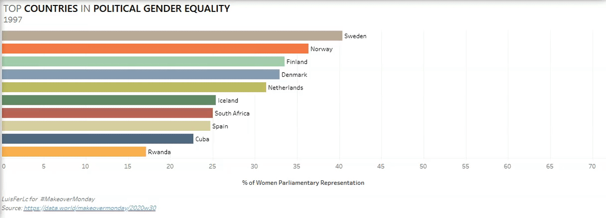

# MakeoverMonday-27.07.2020
Practicing Tableau

Makeover Monday its an initiative for people to practice with Tableau. They public a weekly free dataset so that everyone can create their own visualizations.

This is a dynamic visualization I created with Tableau in which you can see the top 10 countries with more women in parliament and goverment positions around the world. The exercise for this visualization was posted on 20.07.2020 for Makeover Monday.

Link to the visualiation: https://public.tableau.com/views/WomanParlamentRegions/Top10?:language=es&:display_count=y&:origin=viz_share_link

For more information about Makeover Monday: https://www.makeovermonday.co.uk/
